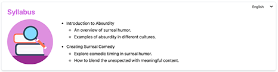

# Ultra Course Snippets

HTML and Tailwind CSS snippets that improve content layout and appearance in Blackboard.

## Main features

- **Responsive**. Works great in larger screens, mobile browses and the Blackboard APP
- **Multi-language**. Added some JS to toogle languages, currently L2R languages can be included.
- **Accesible**. Work in progress with ARIA labels and correct ALT texts.

## How to use

1. Select the snippet that you want to use.
2. Copy as an HTML block inside of a Blackboard Document.
3. Add your data (check each component for more information).
4. Tweak colors or modify the snippet as needed.

## Snippets

### Single Instructor snippet

Large screen view:


Small screen view:


A simple Card to showcase a single/main course instructor, it includes the following customizable elements:

1. **Title**
2. **Language toogle** (Default EN/FR/ES)
3. **Instructor name and pronoums**
4. **Instructor picture**
5. **Contact icons**
6. **Instructor BIO**
7. **Instructor skills/specialities**
8. **Link to research articles**

To customize the content, locate the `const = data` variable in the json around line 69 of the file. I have kept everything in a single file be able to use it directly in an Ultra document.

First, inside `data` there is a section for each language, different languages can have different contents. More locales can be added, but you will need to add the new locale to the language toogle so the option becomes available.

```json
"en": {},
"fr": {},
"es": {},

```

Now, inside each locale section, these are the elements that can be customized

1. **Headers section**. Include your own wording for `about`, `skills` and `research`

    ```json
        "en": {
                        "headers": {
                            "about": "About the Instructor",
                            "skills": "Skills",
                            "research": "My Research"
                        },
    ```

2. **Instructor section**. Change this section to populate `name`, `pronoums`(optional), `about` , `image` (needs to be hosted elsewhere) ,`LinkedIn` url, `email` and `phone`.

    ```json
                    "instructor": {
                        "name": "Sir John Cleese",
                        "pronouns": "(He/Him/His)",
                        "about": "This course is taught by the esteemed Sir John Cleese, an expert in absurdity, master of surrealism, and co-creator of Monty Python’s Flying Circus. With decades of experience in turning the ridiculous into the profound, Sir Cleese will guide you through the nuances of comedic timing, nonsensical dialogue, and why nobody expects the Spanish Inquisition.",
                        "image": "https://ultra.elearningmedia.es/bbcswebdav/xid-669405_1",
                        "linkedin": "https://www.linkedin.com/in/john-cleese/",
                        "email": "john.cleese@example.com",
                        "phone": "+1234567890",
                    }
    ```

3. **Skills Section**. Add skills to the skills dictionary to have then displayed as pills in the card.

    ```json
                        "skills": [
                            "Crop Burning",
                            "Sailing"
                        ],
    ```

4. **Research section**. Add as many research papers as desired, providing `title`,`description` and `link`

    ```json
                        "research": [
                            {
                                "title": "The Absurdity of Comedy",
                                "description": "A deep dive into the role of absurdity in modern comedy and its impact on audiences.",
                                "link": "https://www.example.com/absurdity-comedy"
                            },
                            {
                                "title": "Comedic Timing in Surrealism",
                                "description": "Exploring how timing enhances the absurdity in surrealist comedy.",
                                "link": "https://www.example.com/comedic-timing"
                            },
                            {
                                "title": "The Impact of Nonsense Dialogues",
                                "description": "Analyzing the effect of nonsensical dialogues in the audience's perception of humor.",
                                "link": "https://www.example.com/nonsense-dialogues"
                            }
                        ],
    ```

5. Finally customize the **card colors** by providing values for the card´s `background`, `text`, `pillbackground` (for skills) and `pilltext`

    ```json

                        "colors": {
                            "background": "#FFFFFF",
                            "text": "#d16de3",
                            "pillBackground": "#d16de3",
                            "pillText": "#FFFFFF"
                        }      

    ```

### About the course snippet

Large screen view:


Small screen view:


A card to provide information and tips about the course, useful to share elements about themes, methodologies, course mechanics... it includes the following customizable elements:

1. **Title**
2. **Language toogle** (Default EN/FR/ES)
3. **Description**
4. **sections**

To customize the content, locate the `const = course_content` variable in the json around line 62 of the file. I have kept everything in a single file be able to use it directly in an Ultra document.

First, inside `course_content` there is a section for each language, different languages can have different contents. More locales can be added, but you will need to add the new locale to the language toogle so the option becomes available.

```json
"en": {},
"fr": {},
"es": {},

```

Now, inside each locale section, these are the elements that can be customized

1. **Title and description**

```json
               "title": "How the Course Works",
                "description": "You might think this course would be typical. But, to quote the Spanish Inquisition: \"Nobody expects...\" well, anything in this course to be typical. Each week, you will be introduced to new absurdities, surprise lessons, and sudden diversions (like a discussion about coconuts). Be prepared to laugh, analyze, and eventually create your own Monty Python-inspired content.",
```

2. **Content sections**. Add as many content sections as you wish, providing `title`,`description`,`image` for each section.

```json
                "sections": [
                    {
                        "title": "Learn at Your Own Pace",
                        "description": "Access the course content anytime through our platform. No need to rush—absurdity takes time.",
                        "image": "https://ultra.elearningmedia.es/bbcswebdav/xid-669412_1"
                    },
                    {
                        "title": "Weekly Assignments",
                        "description": "Each week includes assignments to help you create your own absurd, nonsensical, yet brilliant sketches.",
                        "image": "https://ultra.elearningmedia.es/bbcswebdav/xid-669415_1"
                    },
                ]
```

3. **Card colors**. Change the colors of the card accordingly in the colors section of the json.

```json
            {
            "colors": {
                "cardBackground": "#FFFFFF",  
                "cardText": "#000000",        
                "cardBorder": "#d16de3"      
            }
```

## Learning outcomes snippet

A simple card to showcase the course´s learning outcomes in bullets and sub-bullets. It features a SVG icon to make it easier to identify the section

Large screen view:


Small screen view:


To customize the content, locate the `const = content` variable in the json around line 55 of the file. I have kept everything in a single file be able to use it directly in an Ultra document.

First, inside `content` there is a section for each language, different languages can have different contents. More locales can be added, but you will need to add the new locale to the language toogle so the option becomes available.

```json
"en": {},
"fr": {},
"es": {},

```

Now, inside each locale section, these are the elements that can be customized

1.**Card title**. Change "Learning Outcomes" for your desired terminology.

```json
    "title": "Learning Outcomes",
```

2.**Outcomes**. Update `text`for the main formulation of the learning outcome and `details` for secondary elements or description

```json
"outcomes": [
            {
            "text": "Master the art of <strong>absurd humor</strong> and explore its societal impact.",
            "details": [
            "Explore the evolution of humor through history.",
            "Understand the importance of timing in comedy."
            ]
            },
            {
            "text": "Understand how to create comedy through <strong>surreal scenarios</strong> and unexpected turns.",
            "details": [
            "Develop an understanding of absurdity in different cultures.",
            "Learn how to use absurdity in storytelling."
            ]
            }
            ]
```

3.**Card colors**. Customize the colors as desired. Use tailwind colors or regular colors.

```json
    "colors": {
        "background": "bg-stone-600",  
        "text": "#FFFFFF",         
        "cardBackground": "#FFFFFF", 
        "cardText": "#000000",       
        "border": "gray-300"         
        },
```

## Syllabus snippet

A simple card to showcase the course´s syllabus in bullets and sub-bullets. It features a SVG icon to make it easier to identify the section.

Large screen view:



Small screen view:


To customize the content, locate the `const = SyllabusContent` variable in the json around line 55 of the file. I have kept everything in a single file be able to use it directly in an Ultra document.

First, inside `content` there is a section for each language, different languages can have different contents. More locales can be added, but you will need to add the new locale to the language toogle so the option becomes available.

```json
"en": {},
"fr": {},
"es": {},

```

Now, inside each locale section, these are the elements that can be customized

1.**Card title**. Change "Syllabus" for your desired terminology.

```json
    "title": "Syllabus",
```

2.**Content sections**. As as many sections as you need by providing `text`for the main content and `details` for sub-bullets or descriptions.

```json
        "sections": [
            {
                "text": "Introduction to Absurdity",
                "details": [
                    "An overview of surreal humor.",
                    "Examples of absurdity in different cultures."
                    ]
            },
            {
                "text": "Creating Surreal Comedy",
                "details": [
                    "Explore comedic timing in surreal humor.",
                    "How to blend the unexpected with meaningful content."
                    ]
            }
        ]
```

3.**Card colors**. Customize the colors as desired. Use tailwind colors or regular colors.

```json
    "colors": {
        "background": "bg-stone-600",  
        "text": "#FFFFFF",         
        "cardBackground": "#FFFFFF", 
        "cardText": "#000000",       
        "border": "gray-300"         
        },
```

## FAQ Snippet

An accordion card to showcase the course´s frequently asked questions.

Larger screen view


Small screen view


To customize the content, locate the `const = faqContent` variable in the json around line 64 of the file. I have kept everything in a single file be able to use it directly in an Ultra document.

First, inside `faqContent` there is a section for each language, different languages can have different contents. More locales can be added, but you will need to add the new locale to the language toogle so the option becomes available.

```json
"en": {},
"fr": {},
"es": {},
```

Now, inside each locale section, these are the elements that can be customized

1. **Card title**. Change `title` to your preffered terminology.

```json
    "en": {
            "title": "Frequently Asked Questions",
```

2. **FAQ content**. Change this section to add `question` and its respective `answer`

```json
            "faqs": [
                {
                "question": "What is absurd humor?",
                "answer": "Absurd humor is a form of comedy that relies on illogical or nonsensical situations."
                },
                {
                "question": "How can I create surreal comedy?",
                "answer": "Surreal comedy blends unexpected scenarios with meaningful commentary. Timing is crucial."
                    }
                ]
            },
```

3.**Color Section**. Change this section to add different colours to the card.

```json
            "colors": {
                "background": "#d16de3",  
                "text": "#FFFFFF",         
                "cardBackground": "#FFFFFF", 
                "cardText": "#000000",       
                "border": "#ad4bb4"          
            },

```

## Content page

A simple content page divided in a header with a solid background and content sections with text and pictures.


Small screen view


To customize the content, locate the `const = contentData` variable in the json around line 64 of the file. I have kept everything in a single file be able to use it directly in an Ultra document.

First, inside `contentData` there is a section for each language, different languages can have different contents. More locales can be added, but you will need to add the new locale to the language toogle so the option becomes available.

```json
"en": {},
"fr": {},
"es": {},
```

Now, inside each locale section, these are the elements that can be customized

1. **Overview section**. Add your wording for `title` and `description`

```json
            "en": {
                "overview": {
                    "title": "Welcome to the Monty Python Course",
                    "description": "In this course, you’ll explore the absurd, hilarious, and utterly brilliant world of Monty Python. From the dead parrots to lumberjacks, be prepared for a wild ride through classic British comedy."
                },
```

2. **Sections**. For each one of the content sections add `title`, `description`, `description 2`  (for a second paragraph), an url for the `image`, and the `layout` where `alt-right` indicates right alignment and `alt-left` indicates left alignment.

```json
                    {
                        "title": "The Dead Parrot Sketch",
                        "description": "In this section, you'll dive deep into the famous 'Dead Parrot' sketch. Why is it so funny when a parrot is obviously no more? You'll find out! This sketch revolves around a pet shop owner who refuses to admit the parrot is dead, insisting instead that it's 'resting.'",
                        "description2": "You'll explore the themes of denial, absurdity, and the quintessential British humor that make this one of Monty Python's most beloved sketches. We'll also discuss why dead animals are such a recurring theme in their comedy.",
                        "image": "https://ultra.elearningmedia.es/bbcswebdav/xid-669412_1",
                        "layout": "alt-right"
                    },
```

3. **Colors**. Customize the color values to personalize the card, you can use tailwind colors or regular color codes.

```json
        "colors": {
                "cardBackground": "#FFFFFF",  
                "cardText": "#000000",        
                "cardBorder": "#ad4bb4",      
                "titleColor": "#d16de3"       
            },
```


## Known limitations

1. This version uses Tailwind CSS from a CDN.
2. This version imports font-awesome icons from a CDN.
3. Images need to be stored somewhere, these are currently hosted in the content collection in Learn.
4. Examples are very silly.
